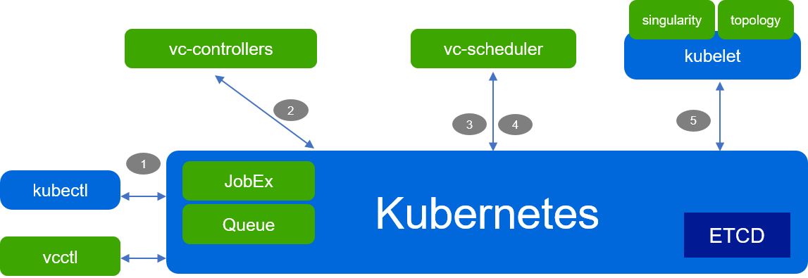

# CNCF SIG Sandbox Project Request

## Acceptance to CNCF Sandbox

**Authors:** Klaus Ma (@k82cn), Ricardo Aravena (@raravena80)

## Background

**_Link to TOC PR_**

https://github.com/cncf/toc/pull/318

**_Link to Presentation_**

https://docs.google.com/presentation/d/1RdplRxmUicu0Y03VoMzap3Fb4amwjvMdLH9K7QxOFiM/edit?usp=sharing

**_Link to GitHub project_**

http://github.com/volcano-sh/volcano

## Project Goal

The goal of Volcano is to help batch workload to be cloud native, by building a Kubernetes based batch system.

As we known, more and more users would like to run batch workload (e.g. AI, BigData, HPC) in cloud native environment;
but several enhancements are required to the orchestration layer, such as:

  - Scheduling: gang-scheduling, fair-sharing, reservation/backfill, etc
  - Job/Queue management: hierarchical queue, indexed job, multiple pod templates, job dependency, etc
  - Data Management: data locality, cache, data aware scheduling, etc
  - Accelerator, e.g. GPU, FPGA, etc
  - Others: Singularity, Round-trip, Throughput, etc

Volcano is a batch system built on Kubernetes. It provides a suite of mechanisms (including the enhancements above) that
are commonly required by many classes of batch & elastic workload including: machine learning/deep learning,
bioinformatics/genomics and other "big data" applications. 

## Current Status

__Feb 8, 2020__

- Stars: 736
- Forks: 174
- Maintainers: 5 (2 Huawei, 1 Facebook, 1 IBM, 1 Tencent)
- Releases: 3
- Commits: 2681
- Contributors: 73
- Integrations:
  - [Spark-Operator](https://github.com/GoogleCloudPlatform/spark-on-k8s-operator/blob/master/docs/volcano-integration.md)
  - [Kubeflow/tf-operator](https://www.kubeflow.org/docs/use-cases/job-scheduling/)
  - [Kubeflow/arena](https://github.com/kubeflow/arena/blob/master/docs/userguide/12-volcanojob.md)
  - [Cromwell](https://cromwell.readthedocs.io/en/stable/backends/Volcano/)
  - [PaddlePaddle](https://www.paddlepaddle.org.cn/documentation/docs/zh/user_guides/howto/training/deploy_ctr_on_baidu_cloud_cn.html#id11)
- Adopters: 12 ([adoption detail](https://github.com/volcano-sh/volcano/blob/master/docs/community/adopters.md))
- Presentation:
  - [KubeCon 2020 EU: Improving GPU Utilization with Kubeflow and Volcano at Tencent - Lei Xue, Tencent & Da Ma, Huawei](https://sched.co/Zet0)
  - [KubeCon 2019 NA: Improving Performance of Deep Learning Workloads With Volcano - Ti Zhou, Baidu Inc](https://sched.co/UaZi)
  - [KubeCon 2019 China: Volcano: Running AI/DL workload on Kubernetes - Da Ma, Huawei](https://sched.co/QXj2)

## Future Plans

Volcano plans to have one release per quarter, summary overall plans as follow (Please refer to
[Volcano Roadmap](https://github.com/volcano-sh/volcano/blob/master/docs/community/roadmap.md) for more detail):

- v0.4 (2020 Q1): GPU sharing/topology, virtual kubelet
- v1.0 (2020 Q2): Improve test coverage, Preemption/Reclaim Enhancement
- v1.x (one release per quarter): Hierarchical Queue, Reservation, Backfill, Execution Time Estimation, Job dependency,
  Plugins per Queue, Data Management, Data Aware Scheduling, etc

# Project Scope

## Clear project definition

Yes, the scope of Volcano is to build a Kuberentes native **batch system** to provide a suite of mechanisms that
are commonly required by many classes of batch & elastic workload including: machine learning/deep learning,
bioinformatics/genomics and other "big data" applications. These types of applications typically run on
generalized domain frameworks like TensorFlow, Spark, PyTorch, MPI, etc, which Volcano integrates with.

## Value-add to the CNCF ecosystem

More and more users would like to run batch workload (e.g. AI, BigData, HPC) in cloud native environment;
Volcano is built as a Kubernetes based, cloud native batch system to help those batch workloads to
use cloud native technologies. It's an enhanced orchestration layer to help batch workloads in CNCF ecosystem.

## Alignment with other CNCF projects

- Volcano helps Kubernetes to run batch workloads natively as a Kubernetes based batch system.
- Volcano works with KubeEdge to support AI + IoT use case.

## Anticipated use cases

- Running Machine Learning workloads with Volcano + Kubernetes, e.g. Kubeflow, PaddlePaddle
- Running Big Data workloads with Volcano + Kubernetes, e.g. Spark
- Running HPC workloads with Volcano + Kubernetes, e.g. OpenMPI, Cromewell
- Running AI + IoT workloads with Volcano + kubeEdge

## Alignment with SIG Reference Model

SIG-Runtime

## High level architecture

The following figure demonstrates the high level architecture of Volcano.
The green boxes are components of Volcano, and the blue boxes are components of Kubernetes.
Volcano is built by Kubernetes extendable machinery, e.g. CRD, controller/operator, multi-schedulers,
CRI, device plugins and so on.

As Volcano is based on Kubernetes extendable machinery, the major workflow is similar to Kubernetes' as follow:
 
1. `kubectl` or `vcctl` creates a `JobEx` object in apiserver if all admission passed
1. `JobExController` creates Pods based on its replicas and templates
1. `vc-scheduler` get the notification of Pod from apiserver
1. `vc-scheduler` chooses hosts for the Pods of `JobEx` based on its policy, e.g. binpack, fair-share
1. `kubelet` gets the notification of Pod from apiserver and then start the container

# Formal Requirements

Sponsors: TBD

# CNCF IP Policy

- github.com/golang/glog (Apache License 2.0)
- github.com/onsi/ginkgo (MIT License)
- github.com/onsi/gomega (MIT License)
- github.com/spf13/cobra (Apache License 2.0)
- github.com/spf13/pflag (BSD 3-Clause "New" or "Revised" License)
- k8s.io/client-go (Apache License 2.0)
- k8s.io/kubernetes (Apache License 2.0)
- k8s.io/apimachinery (Apache License 2.0)
- k8s.io/api (Apache License 2.0)
- k8s.io/apiserver (Apache License 2.0)
- k8s.io/apiextensions-apiserver (Apache License 2.0)
- k8s.io/code-generator (Apache License 2.0)
- golang.org/x/crypto (Go's License)
- k8s.io/code-generator (Apache License 2.0)
- github.com/hashicorp/go-multierror (Mozilla Public License 2.0)

# Other Considerations

## Cloud Native

**Volcano** aligns closely with the Cloud Native Computing Foundation (CNCF) mission, and we agree with
the CNCF philosophy/vision, and would like to contribute.

## Project and Code Quality

- CI/CD: trivas (with 70+ e2e test cases)
- Deployment: [helm chart](https://github.com/volcano-sh/volcano/tree/master/installer/helm/chart) and localup script
- Design documents: https://github.com/volcano-sh/volcano/tree/master/docs/design
- Benefit from CNCF:
  - neutral home for the project
  - bridge with other CNCF projects, e.g. Kubernetes, Containerd, CoreDNS, KubeEdge, etc
