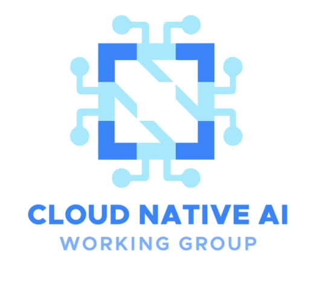
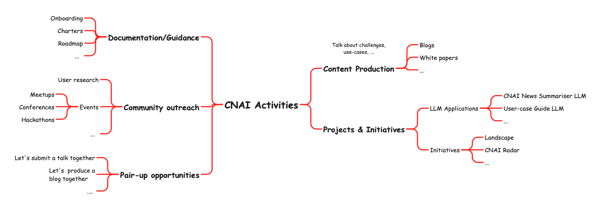

# Introduction

In recent years, the landscape of AI workloads has become more diverse, partly driven by the rapid advancement of Large Language Models and the proliferation of augmented retrieval use cases. This transformative landscape has prompted researchers and industry professionals to explore and develop approaches for effectively addressing the specific needs of these workloads. However, adopting AI workloads is still hindered by the absence of a unified approach, best practices, shared knowledge, and suitable tools to get the job done, which remains an obstacle to adopting AI at scale.

# CNAI Mission

The group's mission is to streamline the integration of artificial intelligence within cloud-native ecosystems, equipping the community with robust frameworks, tools, and best practices that not only ensure scalable, secure, and efficient AI deployments but also simplify bringing product-ready AI workloads to market. We aim to make AI technologies accessible and comprehensible, empowering developers and organizations to innovate and enhance their capabilities within versatile cloud-native environments.

The group addresses the challenge of demystifying AI for a broader audience and ensuring that AI technologies can be effectively deployed, managed, scaled, and secured in cloud-native architectures. Additionally, the group explores how AI can amplify and enhance the user experience for cloud-native technologies.

# In-Scope

* **Identifying End-User Requirements:** Pinpoint current needs, restrictions, and gaps faced by end users when deploying and running AI workflows in the cloud-native space.  
* **Community Engagement:** Foster outreach and collaboration with AI developers and cloud providers, focusing on integrating and managing AI and data within CNCF communities and projects.  
* **Collaboration with AI Entities:** Encourage collaboration with various AI entities, initiatives, and endeavors, including those within the Linux Foundation and external to CNCF, to address AI challenges in the cloud-native field.

# Out of Scope

* Providing legal advice in any jurisdiction.  
* Forming an umbrella organization beyond the CNCF.  
* Establishing compliance and standards bodies outside the CNCF space.  
* Focusing on technologies outside the CNCF's cloud-native definition.  
* Developing new AI algorithms or models.

# CNAI Deliverables

The CNAI Working Group will work to:

* **Produce Detailed Content:** Create blogs, white papers, and user guides.  
* **Develop Practical Tools:** Simplify knowledge acquisition and offer custom recommendations for cloud-native AI deployments.  
* **Enhance Community Collaboration:** Engage in meetups, conferences, hackathons, and gather feedback from users and communities.  
* **Foster Collaboration:** Unite the best ideas within the community to produce new contributions.  
* **Provide Comprehensive Documentation:** Help new members contribute and collaborate effectively through onboarding materials, charters, and roadmaps.

These artifacts are intended for developers, IT professionals, and business stakeholders planning to deploy AI workloads at scale. The outcomes are designed to provide educational and practical resources that improve the implementation and understanding of AI, promote best practices, and showcase real-world use cases.

# Definition of Success

Success is defined by the broad adoption of the working group's contributions and the establishment of self-sustaining practices within the community. A more concrete definition will follow as the group evolves and can measure its impact.

# Strategy & Deliverables

Towards our mission to streamline the integration of artificial intelligence within cloud-native ecosystems, we will produce artifacts in the following categories:

## Content Production

We will produce content such as white papers, blog posts, KubeCon talks, and interviews to:

* Highlight the benefits, challenges, and use cases of AI, making it more accessible.  
* Showcase real-world examples of AI applications, providing valuable insights and practical advice.

**Content Ideas/examples:**

* Impact of cloud-native AI on businesses.  
* AI's impact on sustainability and responsible AI/ML application development.  
* Securing AI in a cloud-native context, and using AI to secure the cloud-native eco-system.  
* Evolution of the cloud-native ecosystem to address scheduling and batch workload issues.  
* Improving inference speed.  
* Evaluating AI/ML applications.  
* Monitoring, observing, and signaling issues for AI/ML.

## Projects & Initiatives

We will produce AI applications to demonstrate CNAI's capabilities and continue our mission of streamlining AI with cloud-native technologies.

**Examples:**

* **CNAI News Summarizer LLM:** An AI-powered tool that provides concise summaries of news articles.  
* **Use-Case Guide LLM:** An interactive guide offering personalized AI application recommendations.  
* **Deployment Showcases:** Demonstrations of deploying AI workloads on cloud-native platforms.  
* **CNAI Landscape:** Mapping existing projects in the cloud-native AI space.  
* **CNAI Radar:** Tracking the latest trends, technologies, and players in AI.

## Documentation/Guidance

To foster community growth, we aim to create guiding materials:

* **Onboarding Guides:** Overviews of the CNAI Working Group and how to get involved.  
* **Mission/Charters:** Clear objectives and expected outcomes for each subgroup.  
* **Roadmaps:** Outlining short-term and long-term goals for alignment and transparency.

## Community Outreach & Feedback Gathering

We will promote the group's achievements and gather feedback to enhance our impact:

- **User Research:** Regular feedback collection to remain responsive to community needs.  
- **Events:** Organizing meetups, conferences, and hackathons.  
- **Collaboration Opportunities:** Encouraging members to work together on projects, blogs, or talks.

## Example Deliverables to Community

**Educate and Inform**

* Whitepapers on end-user requirements and gaps in deploying AI in cloud-native spaces.  
* Current landscape analyses of cloud-native solutions for AI workflows.  
* Surveys on managing community-generated data within AI.  
* Reports on new AI industry trends affecting cloud-native technologies.  
* A "Distinguished Speaker" series for educational outreach.

**Tooling Support & Evaluation**

* Reviews and recommendations for initiatives enabling AI in CNCF projects.  
* API specifications or guidelines for identified gaps.  
* Ontologies of Kubernetes resources for AI/ML models.  
* Literature reviews on data security and privacy in cloud-native environments.

**Audiences**

* **Education:** End users, developers, stakeholders.  
* **Project Intelligence:** TOC/CNCF Community.  
* **External Collaboration:** Organizations and initiatives outside CNCF (e.g., OpenSSF, academic groups).

# Alignment with other Tags

To better understand and utilize the impact of AI on the cloud-native ecosystem, it is within the scope of the AI WG to reach out and align with the rest of the TAGs to make sure there is topic coverage and to implement an AI strategy across the ecosystem in tandem with the rest of the TAGs and working groups.

# Tracking our Work

The work for the working group is currently tracked using GitHub projects: [CNCF Projects](https://github.com/orgs/cncf/projects/38).

# FAQs

**How is CNAI different from other CNCF and AI-related WGs/Tags?**

The CNAI Working Group focuses on the interconnection between AI applications and cloud-native technologies. Unlike groups that address specific technical problems, CNAI explores broader integration challenges to streamline AI workloads within the cloud-native ecosystem. We address both technical concerns (e.g., reference architectures, best practices) and business concerns (e.g., ROI, responsible deployments).

**What is the relationship between the AI Alliance and CNAI?**

The AI Alliance fosters open innovation across the AI landscape, focusing on collaboration and trust in AI technologies. CNAI, on the other hand, concentrates on integrating AI within cloud-native environments, providing the necessary tooling and best practices for scalable and secure AI deployments. Our missions are complementary, advancing the overall AI field.

**What is the relationship between the OPEA and CNAI?**

OPEA offers reference architectures for building LLM and Generative AI applications. CNAI can leverage OPEA's frameworks to provide end-to-end guidance for deploying these architectures using cloud-native tooling, ensuring effective scaling and deployment.

**What are other groups or SIGs that are related to this group?**

* sig-apps  
* Batch-wg (CNCF)  
* wg-batch (Kubernetes)  
* wg-serving (Kubernetes)  
* Accelerator-Management (Kubernetes)
* otel-genai-instrumentation (OpenTelemetry)

# TOC Liaisons

* Cathy Zhang  
* Emily Fox

# TAG Liaisons

TAGs Runtime and Observability are the current hosts of this Working Group, with plans for future extension to its own TAG.

* **Runtime Liaison:**  
  * Ricardo Aravena  
* **Observability Liaisons:**  
  * Alolita Sharma  
  * Matt Young

# WG Leadership

* Cathy Zhang  
* Ricardo Aravena  
* Huamin Chen  
* Ronald Petty  
* Adel Zaalouk  
* Alex Jones (Interim)

# Communications

* **Community Meetings:** Second & Fourth Friday of the month, 8 AM \- 9 AM PT  
* **Zoom:** [https://zoom.us/j/9890721462](https://zoom.us/j/9890721462) (Password: 77777\)  
* **Meeting Notes and Agenda:** [CNAI Working Group Notes](https://bit.ly/cloudnative-ai-working-group)  
* **CNCF Slack:** `#wg-artificial-intelligence`  
* **Mailing List:** [cncf-tag-runtime](https://lists.cncf.io/g/cncf-tag-runtime)
